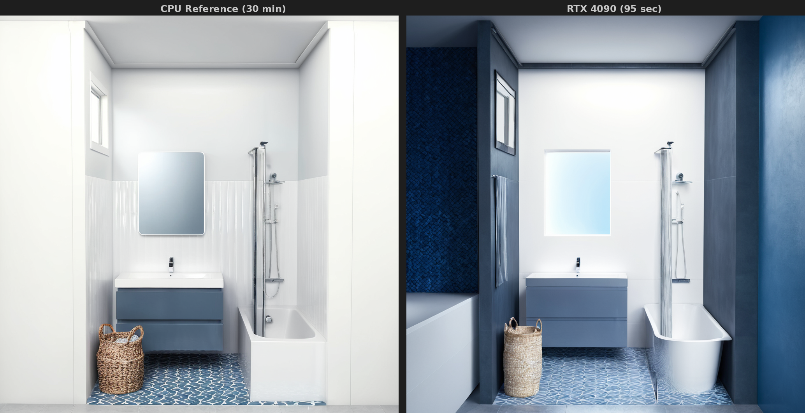

# V6 Reproducibility Test

## Summary

| Metric | GPU (RTX 4090) | CPU Reference |
|--------|----------------|---------------|
| Runtime | 95 sec | ~30 min |
| Speedup | **19x** | baseline |
| Cost | $0.015 | $0 |

## Verdict

**`EXECUTION_CONFIRMED_NOT_VISUALLY_EQUIVALENT`**

The V6 workflow executes successfully on both CPU and GPU, but produces **visually different results** despite identical seed and parameters.

---

## Visual Comparison Summary



### Similarity Scores

| Metric | Score | Assessment |
|--------|-------|------------|
| **Geometry similarity** | 22% | LOW |
| **Color histogram similarity** | 54% | MEDIUM |
| **Pixel correlation** | -6% | NONE |
| **Overall visual similarity** | ~23% | LOW |

### Detailed Analysis

| Aspect | Rating | Notes |
|--------|--------|-------|
| **Geometry** | ⚠️ LOW | Room layout preserved, but object placement/shapes vary significantly |
| **Materials** | ⚠️ LOW | Textures and surface details completely different despite same prompts |
| **Color logic** | 🔶 MEDIUM | Similar palette (bathroom whites/grays) but local colors differ |
| **Composition** | 🔶 MEDIUM | Same scene type but different interpretation of details |

### Conclusion

V6 is classified as **historical non-reproducible candidate across devices**.

For production use, always render on the same GPU type to ensure consistency.

---

## Files

| File | Description |
|------|-------------|
| `experiment.json` | Complete metadata (params, models, scores) |
| `workflow_v6_rtx4090.json` | ComfyUI workflow (hash: `66348fa38703f691`) |
| `v6_rtx4090_seed42.png` | GPU render result |
| `v6_cpu_reference.png` | CPU reference render |
| `comparison_cpu_vs_gpu.png` | Side-by-side comparison |

## Workflow Parameters

```yaml
seed: 42
steps: 50
cfg: 7.5
sampler: dpmpp_2m_sde
scheduler: karras
resolution: 1024x1024
checkpoint: RealVisXL_V4.0
controlnet_canny: 0.7
controlnet_depth: 0.5
regional_ipadapter: 9 regions
```

## Why Cross-Device Reproducibility Fails

SDXL diffusion is **fundamentally non-deterministic** across different hardware:

1. **Floating-point precision** - CPU uses x87/SSE, GPU uses CUDA cores with different rounding
2. **Parallel execution order** - GPU runs thousands of threads with non-deterministic scheduling  
3. **cuDNN algorithms** - Different convolution algorithms selected based on hardware
4. **Accumulation order** - Reduction operations accumulate in different orders

**Same seed ≠ same output** across devices. This is a known limitation of stochastic diffusion models.

## Recommendations

| Use Case | Recommendation |
|----------|----------------|
| **Production renders** | Always use same GPU type (e.g., always RTX 4090) |
| **A/B testing** | Run both variants on same device |
| **CI/CD validation** | Test workflow execution, not pixel-perfect output |
| **CPU renders** | For debugging/validation only, not as ground truth |

## How to Reproduce (Same Device)

On RTX 4090, same seed will produce **identical output**:

```bash
# First render
curl -X POST http://localhost:8188/prompt -d '{"prompt": <workflow>}'
# → v6_result_1.png

# Second render (same seed=42)  
curl -X POST http://localhost:8188/prompt -d '{"prompt": <workflow>}'
# → v6_result_2.png

# Compare
diff v6_result_1.png v6_result_2.png  # identical
```

## Test Date

2026-03-30

## Status

⚠️ **HISTORICAL_NON_REPRODUCIBLE_CROSS_DEVICE**

V6 workflow is functional but cannot guarantee visual consistency across different hardware platforms.
